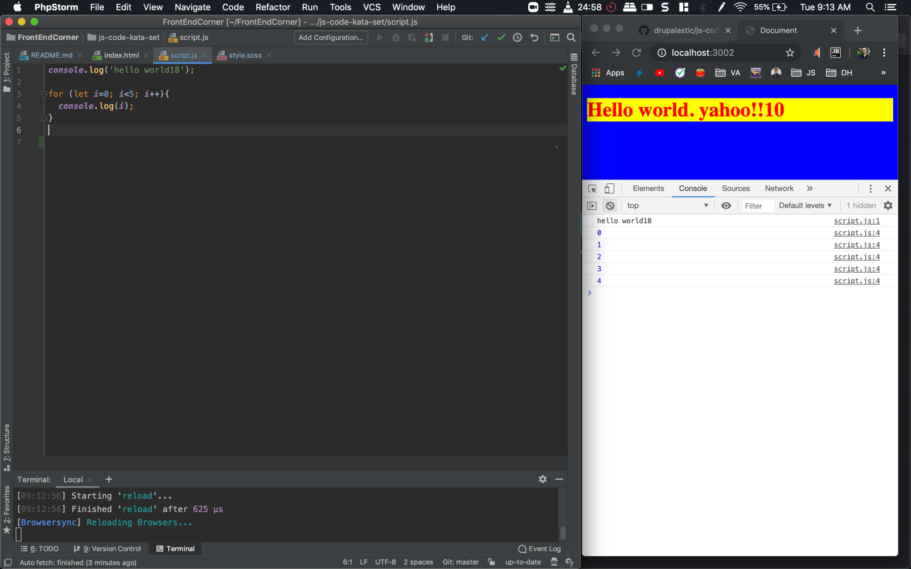

# Set up code kata's in you local system

I prefer this against online platforms for four main reasons :
1. Its easier to use browsers dev tools to debug things
2. Its closer to real world
3. Live reload / refresh is a real time saver
4. I can use my favourite text editors live templates / snippets while practicing

recommended node version : *12.3.1* (We recommend NVM)

setup :
clone the repository
run `npm install`

once install completes
run `node_modules/.bin/gulp watch`

index.html and script.js is used as it is. 
JS files are not processed because most browsers supports latest JS features. In case you are an IE-11 user - you may consider using https://github.com/drupalastic/HTML-SCSS-JS-Starterkit 

style.scss will be compiled to style.css. Browser will refresh automatically on change. 

# Javascript code kata sets

Most of the times we will be using chrome's console and dev tools. So this following setup works well.



Please refer to https://github.com/drupalastic/js-code-kata-set/blob/master/script.js file for solutions.

### JS Code kata 1. Implement a linear search using simple iterative loops.

```$xslt
function linerSearch(list, item) {
  // your code here
}

console.log('liner search result => ', linerSearch([2, 6, 7, 90, 103], 90));

// it must log liner search => 3 (index of 90)
```

### JS Code kata 2. Implement a binary search. We need cut our list to half on every iteration. 

```$xslt
function binarySearch(list, item) {

}

console.log('binary search result => ', binarySearch([2,6,7,90,103,105],90));
// it must log the index of item in the list
```

### JS Code kata 3. Merge two sorted arrays. We have two sorted arrays. Our function must return a merged array which is sorted. 

```$xslt
(function kata3() {
  function mergeList(l,r){

  }

  console.log(mergeList([5,20,50],[7,10,15,30,75])); // return merged sorted array

})();
```
```$xslt
Pseudo code :
Initialize empty array
compare the first index of l to first index of r
push the lower value to the empty array
shift (remove first) array with lower value
repeat until both arrays are empty
```


### JS Code kata 4. Implement Merge sort algorithm. 

```$xslt

```

```$xslt
Pseudo code :                                       // O(n*logn)
mergeSort(list)                                     // -- time complexity --
    initialize n to the length of the list          // constant
    base case if n < 2, just return                 // constant
    initialize mid to n/2                           // constant 
    left = left slice of array to mid-1             
    right = right slice of array mid to n-1
    mergeSort(left);                                // n/2
    mergeSort(right);                               // n/2
    mergeList(left,right);                          // linear

```
    

### JS Code kata 5. Implement Bubble sort algorithm.

Visualize bubble sort - https://www.hackerearth.com/practice/algorithms/sorting/bubble-sort/visualize/


    

### JS Code kata 6. Implement fizz buzz. A function takes any number. Console logs each of them but -
when the number is multiple of 3 instead of number fizz is logged
when the number is multiple of 5 instead of number buzz is logged
when the number is multiple of both fizzBuzz is logged


### JS Code kata 7. Implement a fakeAjax function that returns an array of books. consume that function to console log the list of books.


### JS Code kata 8. Old and busted way of handling async data

consider following fake ajax data function

```
// we pass in a file name and when ever it gets resolved, the callback is called with the resolved data
function fakeAjaxData(file, cb) {

  const fake_database = {
    "file1": "The first text",
    "file2": "The middle text",
    "file3": "The last text"
  };

  console.log("Requesting data -> " + file);

  if (file === "file1") {
    setTimeout(function () {
      cb(fake_database["file1"]);
    }, 3000);
  } else if (file === "file2") {
    setTimeout(function () {
      cb(fake_database["file2"]);
    }, 1000);
  } else {
    setTimeout(function () {
      cb(fake_database["file3"]);
    }, 2000);
  }
}

// *** helper function ***
function output(text){
  console.log(text);
}

```

In case we make an ajax request with following lines of code, we'll get our data but in a different order. modify the below function to return the async data in order 
like:
the first text
the second text
the third text

```
function getFile(file){
  fakeAjaxData(file, function (receivedData) {
    console.log(receivedData);
  })
}

getFile ( "file1");
getFile ( "file2");
getFile ( "file3");
```


### JS Code kata 9. Handling async data using thunk. Implement a thunk called getFile().

Hint: Thunk is basically a closure function. It requests data & it returns a callback. If callback is called before it receives data, it saves the callback inside the closure and calls it once it gets the data. If it gets the data, it stores it inside the closure until the callback is called.

### JS Code kata 10. Handling async data using native promise.

Hint: our getFile function returns a promise. promises will be resolved in the getFile function and then we use `.then` to respond to them.


### JS Code kata 11. Higher order function


### JS Code kata 12. Make the promise chain in kata 10 reusable using map and reduce.


